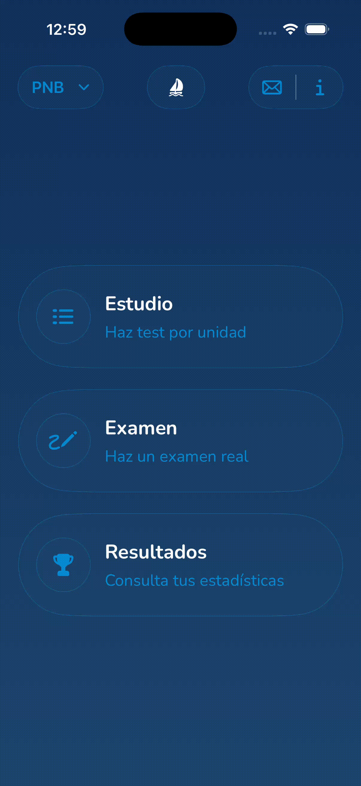
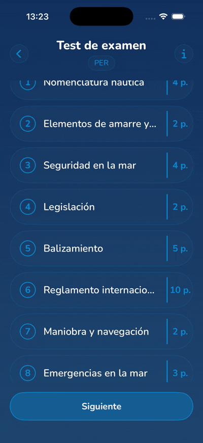
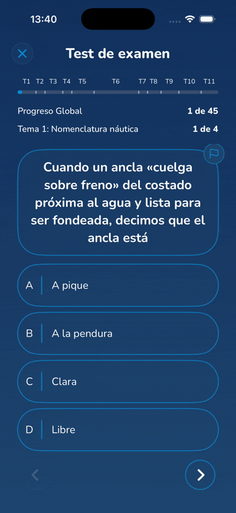
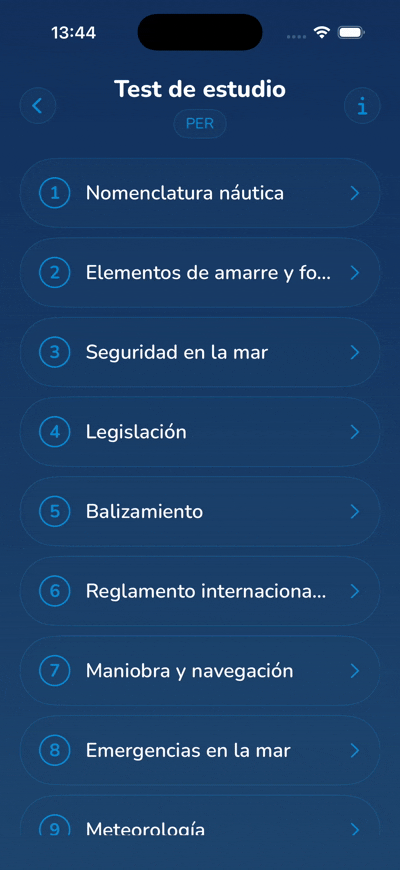
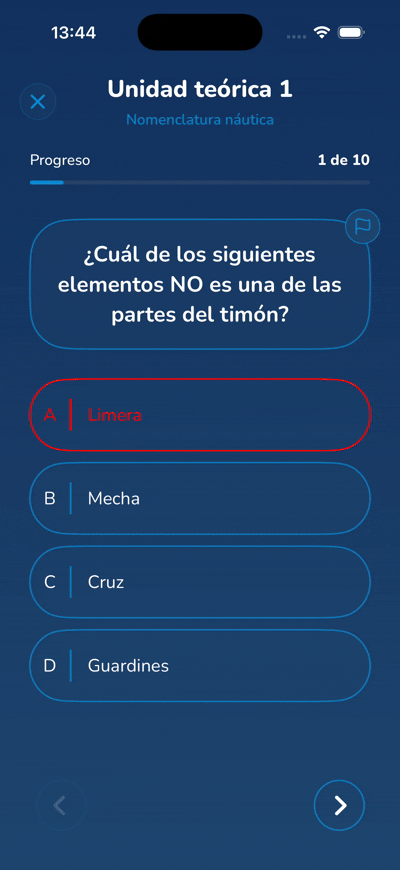
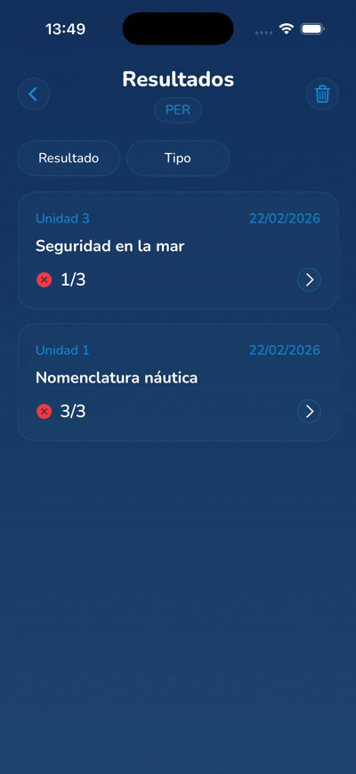
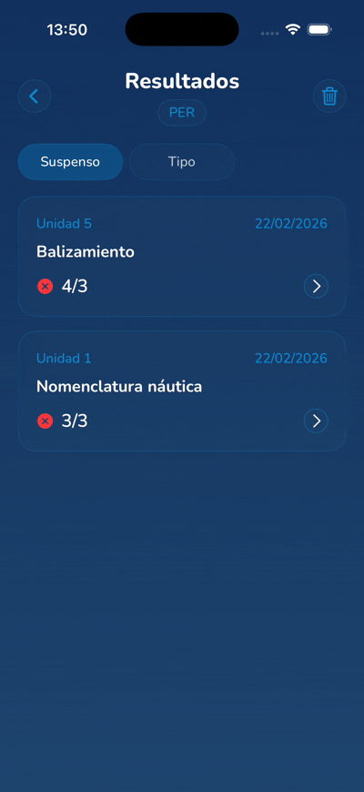

# Patron Test 

**Patron Test** es una aplicación iOS nativa diseñada para ayudar a los aspirantes a obtener las titulaciones náuticas: <br> 
- **PER (Patrón de Embarcaciones de Recreo)** 
- **PNB (Patrón de Navegación Básica)**.

La aplicación ofrece una experiencia de estudio moderna, intuitiva y eficaz, permitiendo a los usuarios practicar con tests por temas o simular exámenes reales, todo ello sin distracciones y con un enfoque centrado en el aprendizaje. Dispone  de preguntas sacas de test examenes reales, revisadas minuciosamente ademas de la capacidad de revisar al detalle todos los test realizados por el usuario.

[](https://swift.org)
[](https://developer.apple.com/xcode/swiftui/)
[](https://developer.apple.com/ios/)
[]()

<br>
<p align="left">
  
</p>
<br>

### Gestión de Licencias


La aplicación se adapta a tu objetivo. Desde el primer momento, puedes seleccionar tu titulación:
- **PER (Patrón de Embarcaciones de Recreo)**
- **PNB (Patrón de Navegación Básica)**
- **Incorporaremos mas titulaciones en el futuro**
 <br>
 El contenido, los iconos y los criterios de evaluación se ajustan automáticamente según la licencia seleccionada, asegurando que estudies exactamente lo que necesitas.

<br>
<br>

| Selección de Licencia |
|:---:|
||

### Modo Examen: Simulación Real

Pon a prueba tus conocimientos con el **Simulador de Examen Oficial**.
- Genera un examen completo siguiendo la estructura oficial del BOE.
- Mismo número de preguntas y distribución por temas que el examen real.
- Corrección automática al finalizar con los criterios oficiales de aprobado/suspenso.

<br>
<br>

| Inicio de Examen | Pantalla de Examen |
|:---:|:---:|
|  ||

### Tests por Unidad: Refuerzo Temático

¿Necesitas mejorar en Balizamiento o Reglamento?
- **Estudio Focalizado**: Selecciona cualquiera de las 11 unidades temáticas para practicar preguntas específicas.
- Ideal para repasar temas concretos después de estudiarlos.
- Feedback inmediato opcional para aprender de cada error al instante.

<br>
<br>

| Selección de Unidad | Test de Unidad |
|:---:|:---:|
|  |  |

###  Historial y Análisis de Resultados

Tu progreso, bajo control. Todo se guarda localmente en tu dispositivo.
- **Listado Completo**: Accede a todos los tests y exámenes que has realizado.
- **Filtros Inteligentes**: Organiza tu historial por:
    - Tipo de Test (Examen vs Unidad).
    - Estado (Aprobado vs Suspenso).
    - Unidad específica.
- **Gestión**: Elimina tests antiguos o irrelevantes deslizando el dedo.

<br>
<br>

| Historial de Resultados | Filtrado de Tests |
|:---:|:---:|
|  |  |

<br>
<p align="left">
  
</p>
<br>

### Tecnologías y buenas prácticas


- **Lenguaje**: Swift 5.9
- **UI Framework**: SwiftUI
- **Arquitectura**: Clean Architecture + MVVM + Coordinator
- **Persistencia Local**: SwiftData
- **Backend / Configuración Remota**: Firebase (Firestore & Remote Config)
- **Inyección de Dependencias**: Contenedor personalizado (AppContainer)
- **Gestión de Estados**: ObservableObject / @Published

<br>
<p align="left">
  
</p>
<br>

La aplicación sigue estrictamente los principios de **Clean Architecture** para asegurar la escalabilidad, testabilidad y mantenibilidad del código.

### Capas del Sistema


1.  **Presentation Layer (MVVM)**:
    -   **Views**: Componentes SwiftUI puramente declarativos.
    -   **ViewModels**: Gestionan el estado de la vista y la lógica de presentación.
    -   **Coordinators**: Gestionan la navegación y el flujo de la aplicación, desacoplando las vistas entre sí.

2.  **Domain Layer**:
    -   **Use Cases**: Encapsulan la lógica de negocio pura (e.g., `FinishTestUseCase`, `GetAvailableLicensesUseCase`).
    -   **Entities**: Modelos de dominio agnósticos a la infraestructura.
    -   **Repositories Protocols**: Interfaces que definen las operaciones de datos.

3.  **Data Layer**:
    -   **Repositories Implementations**: Orquestan la obtención de datos (Local vs Remoto).
    -   **Data Sources**:
        -   **Local**: `SwiftData` para persistencia de exámenes y progreso. `UserDefaults` para preferencias ligeras.
        -   **Remote**: `Firebase` para obtener preguntas actualizadas y configuración.

### Diagrama de Archivos (Estructura Simplificada)


```text
Patron Test/
├── App/                  # Configuración inicial y Root
│   ├── AppNavigation/    # Coordinators y gestión de flujo
│   └── AppState/         # Estado global de la aplicación
├── Core/                 # Inyección de dependencias (DI)
│   └── AppContainer/     # Factory de dependencias
├── Domain/               # Lógica de Negocio (Agnóstico)
│   ├── Models/           # Entidades del dominio
│   ├── UseCases/         # Reglas de negocio (Interactors)
│   └── Repositories/     # Interfaces de repositorios
├── Data/                 # Implementación de Datos
│   ├── DataSource/
│   │   ├── Local/        # SwiftData & UserDefaults
│   │   └── Remote/       # Firebase / API
│   └── Repository/       # Implementación de interfaces
└── Presentation/         # Capa de UI (MVVM)
    ├── HomeView/
    ├── ExamPreviewView/
    ├── TestView/
    └── ResultsView/
```

<br>
<p align="left">
  
</p>
<br>

### Base de Datos Local (SwiftData)

Utilizamos **SwiftData** para una persistencia moderna y eficiente. Esto permite al usuario:
- Guardar su historial de exámenes.
- Consultar resultados anteriores sin conexión.
- Mantener su progreso sincronizado localmente.

### Base de Datos Remota (Firebase)

- **Firestore**: Almacena el banco de preguntas actualizado, permitiendo corregir erratas o añadir nuevas preguntas sin actualizar la app.
- **Remote Config**: Permite ajustar parámetros de la app dinámicamente desde la nube.

<br>
<br>

<p align="left">
  
</p>

###  Sin Login

Creemos en la inmediatez. El usuario descarga la app y empieza a practicar al instante. No hay barreras de entrada, registros ni recolección de datos personales innecesarios.

###  Sin Anuncios

La preparación de un examen requiere concentración. Hemos decidido eliminar cualquier distracción publicitaria para ofrecer la mejor experiencia de estudio posible.

<br>
<br>

<p align="left">
  
</p>

  <h3>
- Conrado Capilla García
<a href="mailto:conradocg@hotmail.es">
  
</a>
<a href="https://www.linkedin.com/in/conrado-capilla/">
  
</a>
</h3>

<h3>
- Javier Cárdenas Perdomo
<a href="mailto:cardenas97vga@gmail.com">
  
</a>
<a href="https://www.linkedin.com/in/javiercardenasperdomo97/">
  
</a>
</h3>
  
<br>


*Proyecto desarrollado con fines educativos y profesionales.*
